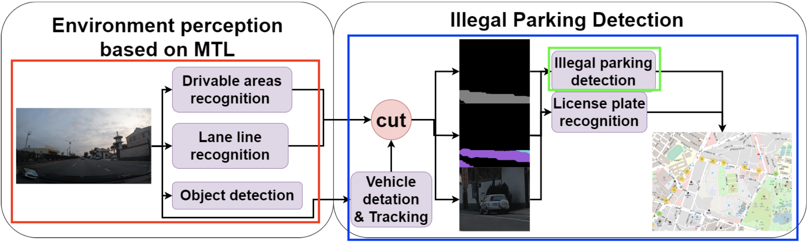

# Driving-environment-perception-and-illegal-parking-identification-based-on-multi-task-learning

The system architecture of this paper is mainly divided into two parts: Environment perception based on MTL and Illegal parking detection system. The first part will identify road signs, drivable areas, and vehicles. The second stage will identify the illegally parked vehicles and collect the vehicle data, and finally display it on the map.

The results of the first part of road perception will be used as input data for the second part of illegal parking identification.

## The code and manual for every part can be checked in the following.
1. [road perception (Red Square)](https://github.com/richardkuo1999/Multi-task-learning-for-road-perception)
2. [illegal parking identification (Blue Square)](https://github.com/richardkuo1999/Violation_Detation)
3. [illegal parking detection (Green Square)](https://github.com/richardkuo1999/Violation_Classification)